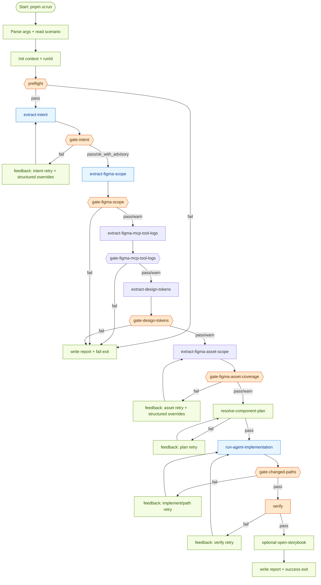
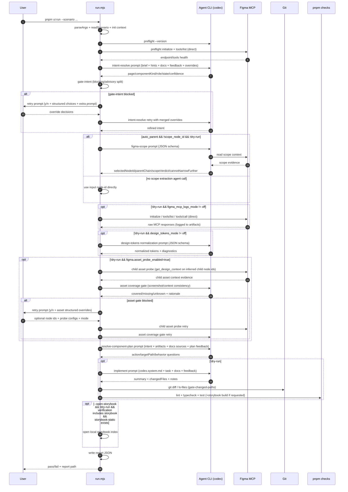
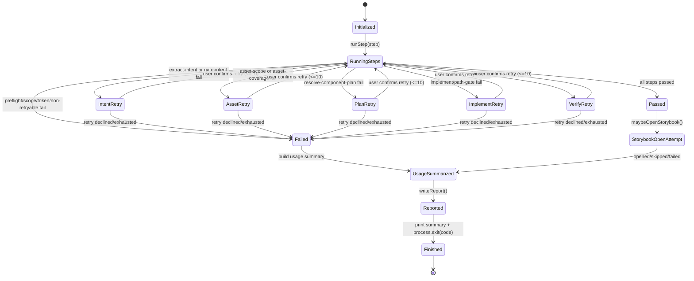
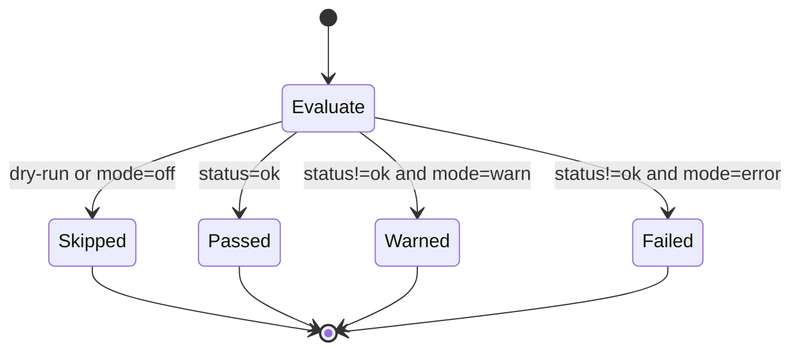

# UI Components Orchestration

Single-command pipeline for turning a Figma node into a validated UI component change.

## Goal

- Keep design-to-code flow reproducible.
- Fail fast when local CLI/MCP prerequisites are missing.
- Apply project UI conventions from `docs/` instead of hard-coded component maps.

## Directory Layout

- `scenarios/`: scenario inputs (`.yml`)
- `prompts/`: system prompt fragments for Codex
- `steps/`: pipeline stages
- `lib/`: shared runtime helpers
- `artifacts/`: per-run outputs (local)
- `reports/`: per-run summary reports (local)

## Run

```bash
pnpm ui:run --scenario orchestration/ui-components/scenarios/jjym-toast.yml
```

## Pipeline Stages

- `preflight`: verify required CLI availability, codex runtime, and direct Figma MCP probe (`initialize` + `tools/list` + required tools).
- `extract-intent`: resolve structured intent from brief/hints + docs conventions + retry context.
- `gate-intent`: validate confidence/fields and split ambiguities into `blocking` vs `advisory`.
- `extract-figma-scope`: parse URL and optionally walk parent scope.
- `gate-figma-scope`: enforce `scopeVerdict` (`sufficient|too_broad|too_narrow|unknown`) with mode (`warn|error`).
- `extract-figma-mcp-tool-logs`: call Figma MCP directly and store raw request/response logs.
- `gate-figma-mcp-tool-logs`: enforce required direct tool-call quality (`off|warn|error`).
- `extract-design-tokens`: normalize tokens from logged MCP evidence (+ agent assistance).
- `gate-design-tokens`: enforce token quality mode (`off|warn|error`).
- `extract-figma-asset-scope`: probe child node contexts from selected scope to recover icon/image/vector hints.
- `gate-figma-asset-coverage`: compare screenshot evidence vs extracted context and block on likely graphic-asset miss.
- `resolve-component-plan`: choose reuse/new target and behavior gate.
- `run-agent-implementation`: implement code changes with system prompt + task context + docs conventions.
- `gate-changed-paths`: block unrelated file changes.
- `verify`: run quality checks (`lint`, `typecheck`, `test`) and Storybook checks. (`test-storybook` is temporarily excluded)
- `feedback-loop`: on `intent/asset/plan/implement/verify` failure, ask terminal input and retry (max 10 attempts per stage).
- If input is unavailable (non-interactive tty), feedback-loop fails fast without auto-retry.
- `report`: write run summary JSON.

Default fixed policy:

- `verification` is always `storybook`.
- `require_visual_approval` is always enabled (`--approve-visual` required).
- `figma_mcp_logs_mode` is fixed to `error`.
- `design_tokens_mode` is fixed to `error`.

## Context Injection Matrix

| Stage                       | Prompt Source                                 | Injected Context                                                                                                                      | Output Artifact                                                     |
| --------------------------- | --------------------------------------------- | ------------------------------------------------------------------------------------------------------------------------------------- | ------------------------------------------------------------------- |
| `preflight`                 | None (local check)                            | required commands, codex runtime, `figma.mcp_endpoint`, MCP `initialize/tools/list` probe                                             | runtime summary only                                                |
| `extract-intent`            | Inline prompt in step code                    | `brief`, `intent hints`, `feedbackLoop.intent`, `intentOverrides`, `docs/reference/*` conventions                                     | `artifacts/*-intent.json`, `agent-trace/*-intent-resolve.*`         |
| `resolve-component-plan`    | Inline prompt in step code                    | resolved intent, design context/token artifact paths, docs convention sources, `feedbackLoop.plan`                                    | in-memory `componentPlan`, `agent-trace/*-resolve-component-plan.*` |
| `run-agent-implementation`  | `prompts/codex.system.md` + inline task block | resolved intent, plan, design context/token artifacts, full docs convention content, `feedbackLoop.implement`, `feedbackLoop.verify`  | code changes + `agent-trace/*-implement.*`                          |
| `extract-design-tokens`     | Inline prompt in step code                    | direct MCP log artifact path + direct tool records (`figmaMcpDirectToolRecords`)                                                      | `artifacts/*-design-tokens.json`                                    |
| `extract-figma-asset-scope` | Local direct MCP probe                        | selected node `get_design_context` output + child node-id inference + direct MCP probe (`get_design_context`) + `assetProbeOverrides` | `artifacts/*-figma-asset-scope.json`                                |
| `gate-figma-asset-coverage` | Inline prompt in step code                    | direct MCP logs + asset-scope artifact + screenshot/context consistency rules + `feedbackLoop.asset` retry notes                      | `artifacts/*-figma-asset-coverage.json`                             |
| `report`                    | None (local serialization)                    | step logs, warnings, `feedbackHistory`, token usage, artifact paths, `intentOverrides`, `assetProbeOverrides`                         | `reports/<runId>.json`, `reports/index.jsonl`                       |

## Orchestration Diagrams

### Step Ownership Map

| Step                          | Type                 | Primary Runtime                                    |
| ----------------------------- | -------------------- | -------------------------------------------------- |
| `preflight`                   | Gate + Runtime check | Local shell + Agent CLI version + direct MCP probe |
| `extract-intent`              | Extraction           | Agent CLI                                          |
| `gate-intent`                 | Gate                 | Local code                                         |
| `extract-figma-scope`         | Extraction           | Agent CLI + Figma MCP (conditional)                |
| `gate-figma-scope`            | Gate                 | Local code                                         |
| `extract-figma-mcp-tool-logs` | Extraction           | Local direct MCP HTTP calls                        |
| `gate-figma-mcp-tool-logs`    | Gate                 | Local code                                         |
| `extract-design-tokens`       | Extraction           | Agent CLI (normalization) + logged MCP evidence    |
| `gate-design-tokens`          | Gate                 | Local code                                         |
| `extract-figma-asset-scope`   | Extraction           | Local direct MCP HTTP calls                        |
| `gate-figma-asset-coverage`   | Gate                 | Agent CLI + Local gate policy                      |
| `resolve-component-plan`      | Planning + Gate      | Agent CLI + local behavior guard                   |
| `run-agent-implementation`    | Implementation       | Agent CLI                                          |
| `gate-changed-paths`          | Gate                 | Local git diff                                     |
| `verify`                      | Gate                 | Local `pnpm` checks                                |
| `report`                      | Finalization         | Local filesystem                                   |

### Detailed Orchestration Flow



### Agent vs Tool Sequence



### Run State Machine



### Gate Policy State Machine (`warn` vs `error`)



## Scenario Shape (Minimal)

```yaml
brief: 'Favorite toast on image result page, success state'

figma:
  url: 'https://www.figma.com/design/.../TEMP?node-id=1-427&m=dev'
```

## Scenario Keys

- `brief`: required natural-language context for intent extraction
- `intent.page|component_kind|role|state|notes`: optional hints for stable intent resolution
- `behavior.confirmed`: set `true` when creating a new interactive component with explicit behavior
- `behavior.spec`: behavior contract text (required if `behavior.confirmed=true`)
- `gates.intent_mode`: intent gate strictness (`warn|error`, default `error`)
- `gates.intent_min_confidence`: minimum intent confidence (`0.0~1.0`, default `0.75`)
- `gates.scope_gate_mode`: scope gate strictness (`warn|error`, default `warn`)
- `gates.asset_coverage_mode`: screenshot/context asset coverage strictness (`off|warn|error`, default `error`)
- `figma.mcp_endpoint`: direct MCP endpoint for preflight/logging/capture (default: `http://127.0.0.1:3845/mcp`)
- `figma.mcp_auth_token_env`: env var name for remote MCP bearer token (example: `FIGMA_MCP_ACCESS_TOKEN`)
- `figma.auto_parent`: if `true`, scope extraction agent can walk parent chain (`default: true`)
- `figma.parent_hops_max`: maximum parent hops during auto scope selection (`default: 3`)
- `figma.scope_node_id`: explicit scope override to skip agent scope walk
- `figma.asset_probe_enabled`: enable child asset probe stage (`default: true`)
- `figma.asset_probe_max_candidates`: max inferred child node ids to probe (`default: 8`)
- `figma.asset_probe_timeout_ms`: timeout per child probe call (`default: figma.timeout_ms`)
- `gates.allowed_changed_paths`: explicit allowed change paths

## Scope Gate Behavior

- Gate verdict enum is fixed: `sufficient|too_broad|too_narrow|unknown`.
- `sufficient` always passes.
- `too_broad` with `cannotNarrowFurther=true` passes with warning (to avoid false-fail at parent-hop limit).
- `too_broad|too_narrow|unknown` follow `gates.scope_gate_mode`:
  - `error`: fail the run.
  - `warn`: continue with warning.
- If scope selection is unstable, prefer setting `figma.scope_node_id` explicitly.

## Behavior Decision Gate

- If a similar existing component is found, pipeline follows the existing behavior pattern.
- If no similar component exists and the planned target is interaction-heavy, pipeline stops and asks for explicit behavior confirmation in scenario.

## Notes

- Prompt files in `prompts/` are explicitly injected by `ui:run`.
- Agent runtime is fixed to Codex (`codexf` preferred, fallback to `codex`).
- Codex invocation pins model/runtime overrides: `-m gpt-5.3-codex` and `-c model_reasoning_effort="medium"`.
- Baseline UI rule docs are always injected: `docs/reference/ui-component-design-conventions.md`, `docs/reference/styling-system.md`, `docs/reference/component-catalog.md`.
- Per-agent prompt/stdout/stderr/parsed JSON are saved in `artifacts/<runId>/agent-trace/`.
- Direct Figma MCP request/response logs are saved under `artifacts/<runId>/figma-mcp-raw/`.
- For remote MCP endpoint, set a bearer token env (`FIGMA_MCP_ACCESS_TOKEN` by default, or custom via `figma.mcp_auth_token_env`).
- Run report includes `figmaMcpToolUsage` and `agentTokenUsage` summaries.
- `reports/index.jsonl` is auto-generated every run for quick team summary.
- Auto cleanup runs every execution: keep only recent 7 days or recent 10 runs (reports + linked artifacts).
- Run report JSON includes `feedbackHistory` (retry question prompts + raw user answers).
- Run report JSON includes `intentOverrides` (structured user decisions from intent retry loop).
- Run report JSON includes `assetProbeOverrides` (structured user decisions from asset retry loop).
- Run report JSON includes `figmaAssetScopeArtifactPath` and `figmaAssetCoverageArtifactPath`.
- Use `--open-storybook` to open `storybook-static/index.html` after a successful run.
