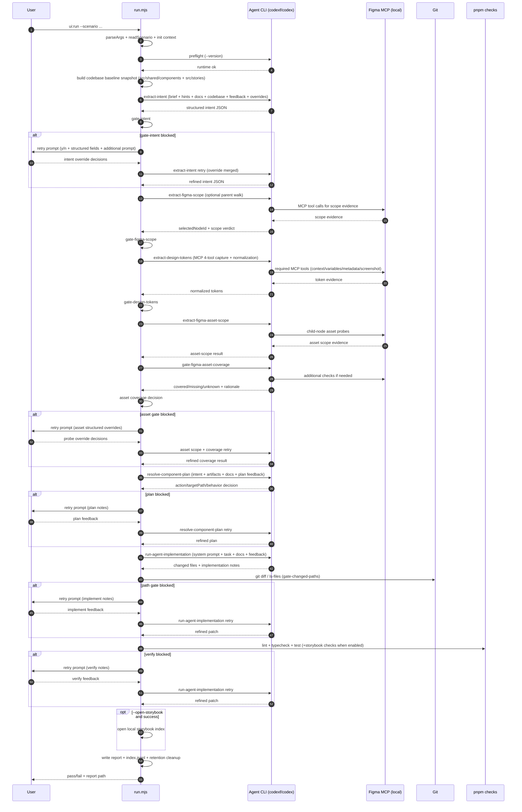
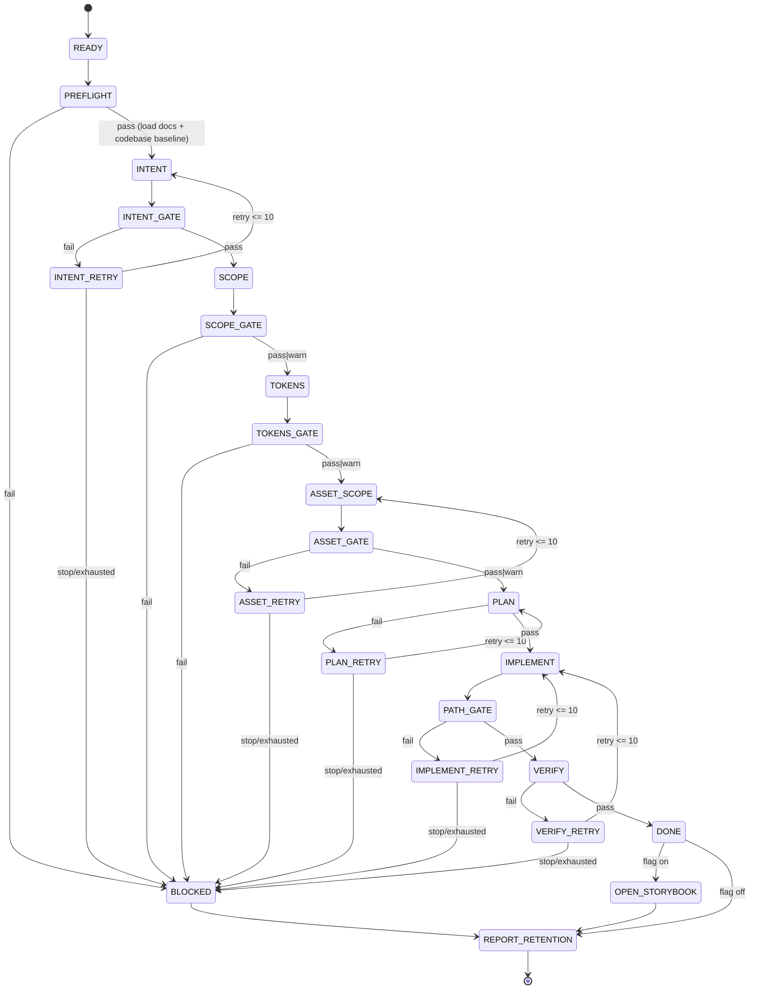
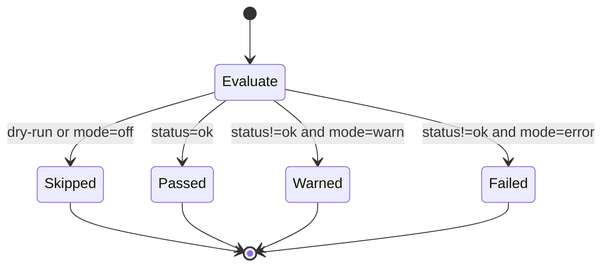

# UI Components Orchestration

Single-command pipeline for turning a Figma node into a validated UI component change.

## Goal

- Keep design-to-code flow reproducible.
- Fail fast when local CLI/MCP prerequisites are missing.
- Apply project UI conventions from `docs/` instead of hard-coded component maps.

## Directory Layout

- `scenarios/`: scenario inputs (`.yml`)
- `steps/`: pipeline stages
- `lib/`: shared runtime helpers
- `artifacts/`: per-run outputs (local)
- `reports/`: per-run summary reports (local)

## Run

```bash
pnpm ui:run --scenario orchestration/ui-components/scenarios/jjym-toast.yml
```

## Pipeline Stages

- `preflight`: verify required CLI availability and codex runtime.
- `extract-intent`: resolve structured intent from brief/hints + docs conventions + retry context.
- `gate-intent`: validate confidence/fields and split ambiguities into `blocking` vs `advisory`.
- `extract-figma-scope`: parse URL and optionally walk parent scope.
- `gate-figma-scope`: enforce `scopeVerdict` (`sufficient|too_broad|too_narrow|unknown`) with mode (`warn|error`).
- `extract-design-tokens`: Codex가 필수 Figma MCP 도구(4/4)를 호출하고 토큰을 정규화합니다.
- `gate-design-tokens`: enforce MCP tool coverage + token quality mode (`off|warn|error`).
- `extract-figma-asset-scope`: Codex가 child node MCP 탐색을 수행해 asset context를 확장합니다.
- `gate-figma-asset-coverage`: compare screenshot evidence vs extracted context and block on likely graphic-asset miss.
- `resolve-component-plan`: choose reuse/new target and behavior gate.
- `run-agent-implementation`: implement code changes with system prompt + task context + docs conventions.
- `gate-changed-paths`: block unrelated file changes.
- `verify`: run quality checks (`lint`, `typecheck`, `test`) and Storybook checks. (`test-storybook` is temporarily excluded)
- `feedback-loop`: on `intent/asset/plan/implement/verify` failure, ask terminal input and retry (max 10 attempts per stage).
- If input is unavailable (non-interactive tty), feedback-loop fails fast without auto-retry.
- `report`: write run summary JSON.

Default fixed policy:

- `verification` is always `storybook`.
- `require_visual_approval` is always enabled (`--approve-visual` required).
- `design_tokens_mode` is fixed to `error`.

## Context Injection Matrix

| Stage                       | Prompt Source              | Injected Context                                                                                                                     | Output Artifact                                                     |
| --------------------------- | -------------------------- | ------------------------------------------------------------------------------------------------------------------------------------ | ------------------------------------------------------------------- |
| `preflight`                 | None (local check)         | required commands, codex runtime                                                                                                     | runtime summary only                                                |
| `extract-intent`            | Inline prompt in step code | `brief`, `intent hints`, `feedbackLoop.intent`, `docs/reference/*` conventions                                                       | `artifacts/*-intent.json`, `agent-trace/*-intent-resolve.*`         |
| `resolve-component-plan`    | Inline prompt in step code | resolved intent, design context/token artifact paths, docs convention sources, `feedbackLoop.plan`                                   | in-memory `componentPlan`, `agent-trace/*-resolve-component-plan.*` |
| `run-agent-implementation`  | Inline prompt in step code | resolved intent, plan, design context/token artifacts, full docs convention content, `feedbackLoop.implement`, `feedbackLoop.verify` | code changes + `agent-trace/*-implement.*`                          |
| `extract-design-tokens`     | Inline prompt in step code | selected scope node + direct Figma MCP calls(4 tools) + docs conventions                                                             | `artifacts/*-design-tokens.json`                                    |
| `extract-figma-asset-scope` | Inline prompt in step code | selected node evidence + child node-id inference + Codex MCP probe + scenario asset probe config                                     | `artifacts/*-figma-asset-scope.json`                                |
| `gate-figma-asset-coverage` | Inline prompt in step code | MCP evidence artifact + asset-scope artifact + screenshot/context consistency rules + `feedbackLoop.asset` retry notes               | `artifacts/*-figma-asset-coverage.json`                             |
| `report`                    | None (local serialization) | step logs, warnings, `feedbackHistory`, token usage, artifact paths                                                                  | `reports/<runId>.json`, `reports/index.jsonl`                       |

## Orchestration Diagrams

### Step Ownership Map

| Step                        | Type                 | Primary Runtime                                    |
| --------------------------- | -------------------- | -------------------------------------------------- |
| `preflight`                 | Gate + Runtime check | Local shell + Agent CLI version                    |
| `extract-intent`            | Extraction           | Agent CLI                                          |
| `gate-intent`               | Gate                 | Local code                                         |
| `extract-figma-scope`       | Extraction           | Agent CLI + Figma MCP (conditional)                |
| `gate-figma-scope`          | Gate                 | Local code                                         |
| `extract-design-tokens`     | Extraction           | Agent CLI + Figma MCP (+ evidence-aware normalize) |
| `gate-design-tokens`        | Gate                 | Local code                                         |
| `extract-figma-asset-scope` | Extraction           | Agent CLI + Figma MCP                              |
| `gate-figma-asset-coverage` | Gate                 | Agent CLI + Local gate policy                      |
| `resolve-component-plan`    | Planning + Gate      | Agent CLI + local behavior guard                   |
| `run-agent-implementation`  | Implementation       | Agent CLI                                          |
| `gate-changed-paths`        | Gate                 | Local git diff                                     |
| `verify`                    | Gate                 | Local `pnpm` checks                                |
| `report`                    | Finalization         | Local filesystem                                   |

### Detailed Orchestration Flow

```mermaid
flowchart TD
  A([Start: pnpm ui:run]) --> B[Parse args + read scenario]
  B --> C[Init context + runId]
  C --> D{{preflight}}

  D -- fail --> Z1[write report + retention + fail exit]
  D -- pass --> I1[extract-intent (docs + codebase baseline)]
  I1 --> I2{{gate-intent}}
  I2 -- fail --> I3[feedback: intent retry + structured overrides]
  I3 --> I1
  I2 -- pass --> S1[extract-figma-scope]

  S1 --> S2{{gate-figma-scope}}
  S2 -- fail --> Z1
  S2 -- pass --> T1[extract-design-tokens]
  T1 --> T2{{gate-design-tokens}}
  T2 -- fail --> Z1
  T2 -- pass --> A1[extract-figma-asset-scope]

  A1 --> A2{{gate-figma-asset-coverage}}
  A2 -- fail --> A3[feedback: asset retry + structured overrides]
  A3 --> A1
  A2 -- pass --> P1[resolve-component-plan]

  P1 -- fail --> P2[feedback: plan retry]
  P2 --> P1
  P1 -- pass --> C1[run-agent-implementation]

  C1 --> C2{{gate-changed-paths}}
  C2 -- fail --> C3[feedback: implement retry]
  C3 --> C1
  C2 -- pass --> V1[verify]

  V1 -- fail --> V2[feedback: verify retry]
  V2 --> C1
  V1 -- pass --> O1[optional open-storybook]
  O1 --> Z2[write report + retention + success exit]

  classDef gate fill:#ffe8cc,stroke:#d9480f,color:#5c2b00;
  classDef agent fill:#e7f5ff,stroke:#1c7ed6,color:#0b3d91;
  classDef local fill:#f4fce3,stroke:#5c940d,color:#2b5a00;
  class D,I2,S2,T2,A2,C2,V1 gate;
  class I1,S1,T1,A1,P1,C1 agent;
  class A,B,C,Z1,Z2,I3,A3,P2,C3,V2,O1 local;
```

### Agent vs Tool Sequence



### Run State Machine



### Gate Policy State Machine (`warn` vs `error`)



## Scenario Shape (Minimal)

```yaml
brief: 'Favorite toast on image result page, success state'

figma:
  url: 'https://www.figma.com/design/.../TEMP?node-id=1-427&m=dev'
```

## Scenario Keys

- `brief`: required natural-language context for intent extraction
- `intent.page|component_kind|role|state|notes`: optional hints for stable intent resolution
- `intent.component_kind` canonical values: `toast|snackbar|banner|tooltip|modal|dialog|alert|callout|bottom_sheet|drawer|sheet|popover|dropdown|menu|context_menu|tabs|accordion|carousel|pagination|breadcrumb|stepper|combobox|date_picker|time_picker|file_upload|segmented_control|range_slider|chip|card|table|avatar|badge|timeline|tree|calendar|chart|map|list_item|empty_state|input|textarea|select|checkbox|radio|switch|search_bar|filter_bar|filter_chip_group|progress|skeleton|image|icon|illustration|video`
- `intent.role` canonical values: `global|local|inline` (`unknown` is reserved for unresolved extraction output)
- `intent.component_kind` / `intent.role` hints accept alias input (Korean/English synonyms) and are normalized to canonical values during extraction
- `behavior.confirmed`: set `true` when creating a new interactive component with explicit behavior
- `behavior.spec`: behavior contract text (required if `behavior.confirmed=true`)
- `gates.intent_mode`: intent gate strictness (`warn|error`, default `error`)
- `gates.intent_min_confidence`: minimum intent confidence (`0.0~1.0`, default `0.75`)
- `gates.scope_gate_mode`: scope gate strictness (`warn|error`, default `warn`)
- `gates.asset_coverage_mode`: screenshot/context asset coverage strictness (`off|warn|error`, default `error`)
- `figma.mcp_endpoint`: local desktop MCP endpoint (fixed default: `http://127.0.0.1:3845/mcp`)
- `figma.auto_parent`: if `true`, scope extraction agent can walk parent chain (`default: true`)
- `figma.parent_hops_max`: maximum parent hops during auto scope selection (`default: 3`)
- `figma.scope_node_id`: explicit scope override to skip agent scope walk
- `figma.asset_probe_enabled`: enable child asset probe stage (`default: true`)
- `figma.asset_probe_max_candidates`: max inferred child node ids to probe (`default: 8`)
- `figma.asset_probe_timeout_ms`: timeout per child probe call (`default: figma.timeout_ms`)
- `gates.allowed_changed_paths`: explicit allowed change paths

## Scope Gate Behavior

- Gate verdict enum is fixed: `sufficient|too_broad|too_narrow|unknown`.
- `sufficient` always passes.
- `too_broad` with `cannotNarrowFurther=true` passes with warning (to avoid false-fail at parent-hop limit).
- `too_broad|too_narrow|unknown` follow `gates.scope_gate_mode`:
  - `error`: fail the run.
  - `warn`: continue with warning.
- If scope selection is unstable, prefer setting `figma.scope_node_id` explicitly.

## Behavior Decision Gate

- If a similar existing component is found, pipeline follows the existing behavior pattern.
- If no similar component exists and the planned target is interaction-heavy, pipeline stops and asks for explicit behavior confirmation in scenario.

## Notes

- Stage system prompts are defined inline in each step module.
- Agent runtime is fixed to Codex (`codexf` preferred, fallback to `codex`).
- Codex invocation pins model/runtime overrides: `-m gpt-5.3-codex` and `-c model_reasoning_effort="high"`.
- Baseline UI rule docs are always injected: `docs/reference/ui-component-design-conventions.md`, `docs/reference/styling-system.md`, `docs/reference/component-catalog.md`.
- Per-agent prompt/stdout/stderr/parsed JSON are saved in `artifacts/<runId>/agent-trace/`.
- Codex MCP traces are saved in `artifacts/<runId>/agent-trace/*stdout.txt` (`mcp_tool_call` events).
- MCP guardrails are fixed in code: per-stage max calls/failures + per-run total max calls.
- Run report includes `figmaMcpToolUsage` and `agentTokenUsage` summaries.
- Run report includes `agentMcpToolUsage` (purpose별 MCP 호출 상세).
- `reports/index.jsonl` is auto-generated every run for quick team summary.
- Auto cleanup runs every execution: keep only recent 7 days or recent 10 runs (reports + linked artifacts).
- Run report JSON includes `feedbackHistory` (retry question prompts + raw user answers).
- Run report JSON includes `figmaAssetScopeArtifactPath` and `figmaAssetCoverageArtifactPath`.
- Use `--open-storybook` to open `storybook-static/index.html` after a successful run.
