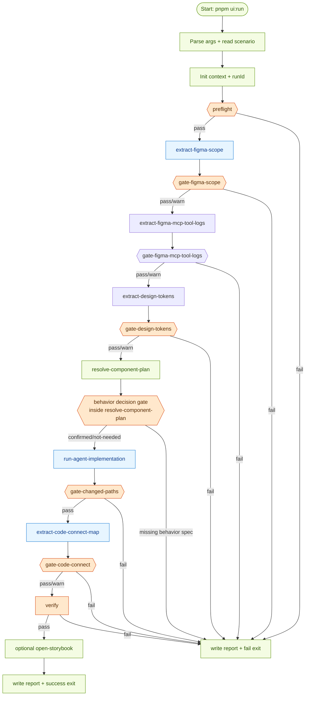
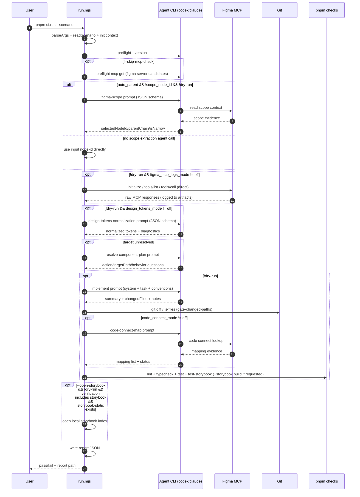
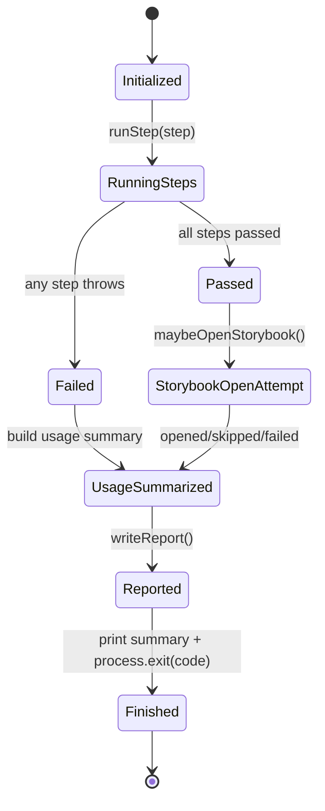
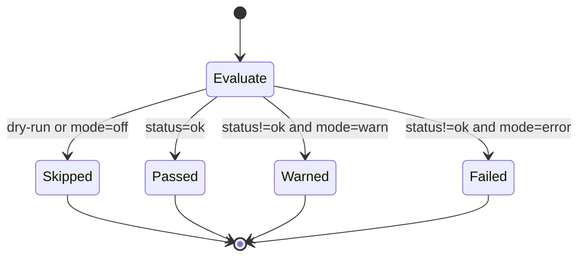

# UI Components Orchestration

Single-command pipeline for turning a Figma node into a validated UI component change.

## Goal

- Keep design-to-code flow reproducible.
- Fail fast when local CLI/MCP prerequisites are missing.
- Apply project UI conventions from `docs/` instead of hard-coded component maps.

## Directory Layout

- `scenarios/`: scenario inputs (`.yml`)
- `prompts/`: system prompt fragments for Codex/Claude
- `steps/`: pipeline stages
- `lib/`: shared runtime helpers
- `artifacts/`: per-run outputs (local)
- `reports/`: per-run summary reports (local)

## Run

```bash
pnpm ui:run --scenario orchestration/ui-components/scenarios/jjym-toast.yml
```

## Pipeline Stages

- `preflight`: verify CLI + MCP availability.
- `extract-figma-scope`: parse URL and optionally walk parent scope.
- `gate-figma-scope`: fail when selected scope is still too broad.
- `extract-figma-mcp-tool-logs`: call Figma MCP directly and store raw request/response logs.
- `gate-figma-mcp-tool-logs`: enforce required direct tool-call quality (`off|warn|error`).
- `extract-design-tokens`: normalize tokens from logged MCP evidence (+ agent assistance).
- `gate-design-tokens`: enforce token quality mode (`off|warn|error`).
- `resolve-component-plan`: choose reuse/new target and behavior gate.
- `run-agent-implementation`: implement code changes with injected context docs.
- `gate-changed-paths`: block unrelated file changes.
- `extract-code-connect-map`: collect Code Connect mapping evidence.
- `gate-code-connect`: compare mapping paths with planned target.
- `verify`: run quality checks (`lint`, `typecheck`, `test`, `test-storybook`) and Storybook checks.
- `report`: write run summary JSON.

## Orchestration Diagrams

### Step Ownership Map

| Step                          | Type                 | Primary Runtime                                 |
| ----------------------------- | -------------------- | ----------------------------------------------- |
| `preflight`                   | Gate + Runtime check | Local shell + Agent CLI version/mcp check       |
| `extract-figma-scope`         | Extraction           | Agent CLI + Figma MCP (conditional)             |
| `gate-figma-scope`            | Gate                 | Local code                                      |
| `extract-figma-mcp-tool-logs` | Extraction           | Local direct MCP HTTP calls                     |
| `gate-figma-mcp-tool-logs`    | Gate                 | Local code                                      |
| `extract-design-tokens`       | Extraction           | Agent CLI (normalization) + logged MCP evidence |
| `gate-design-tokens`          | Gate                 | Local code                                      |
| `resolve-component-plan`      | Planning + Gate      | Local code, optional Agent CLI                  |
| `run-agent-implementation`    | Implementation       | Agent CLI                                       |
| `gate-changed-paths`          | Gate                 | Local git diff                                  |
| `extract-code-connect-map`    | Extraction           | Agent CLI + Figma MCP                           |
| `gate-code-connect`           | Gate                 | Local code                                      |
| `verify`                      | Gate                 | Local `pnpm` checks                             |
| `report`                      | Finalization         | Local filesystem                                |

### Detailed Orchestration Flow



### Agent vs Tool Sequence



### Run State Machine



### Gate Policy State Machine (`warn` vs `error`)



## Scenario Shape (Minimal)

```yaml
id: jjym-toast

figma:
  url: 'https://www.figma.com/design/.../TEMP?node-id=1-427&m=dev'

agent:
  engine: codex
```

## Scenario Keys (Optional)

- `target`: explicit single target file path (preferred for deterministic updates)
- `targets`: legacy list form; only one target is supported in automatic planning
- `context.ui_rules_docs`: additional docs to inject as coding conventions
- `behavior.confirmed`: set `true` when creating a new interactive component with explicit behavior
- `behavior.spec`: behavior contract text (required if `behavior.confirmed=true`)
- `figma.mcp_endpoint`: direct MCP endpoint for raw tool logging (default: `https://mcp.figma.com/mcp`)
- `figma.mcp_auth_token_env`: env var name for remote MCP bearer token (example: `FIGMA_MCP_ACCESS_TOKEN`)
- `gates.figma_mcp_logs_mode`: `off|warn|error` (direct MCP log gate)
- `gates.design_tokens_mode`: `off|warn|error`
- `gates.code_connect_mode`: `off|warn|error`
- `gates.allowed_changed_paths`: explicit allowed change paths
- `gates.require_visual_approval`: require `--approve-visual` when Storybook verification is enabled

## Behavior Decision Gate

- If a similar existing component is found, pipeline follows the existing behavior pattern.
- If no similar component exists and the planned target is interaction-heavy, pipeline stops and asks for explicit behavior confirmation in scenario.

## Notes

- Prompt files in `prompts/` are explicitly injected by `ui:run`.
- Baseline UI rule docs are always injected: `docs/reference/ui-component-design-conventions.md`, `docs/reference/styling-system.md`, `docs/reference/component-catalog.md`.
- Per-agent prompt/stdout/stderr/parsed JSON are saved in `artifacts/<runId>/agent-trace/`.
- Direct Figma MCP request/response logs are saved under `artifacts/<runId>/figma-mcp-raw/`.
- For remote MCP, set a bearer token env (`FIGMA_MCP_ACCESS_TOKEN` by default, or custom via `figma.mcp_auth_token_env`).
- Run report includes `figmaMcpToolUsage` and `agentTokenUsage` summaries.
- Use `--open-storybook` to open `storybook-static/index.html` after a successful run.
